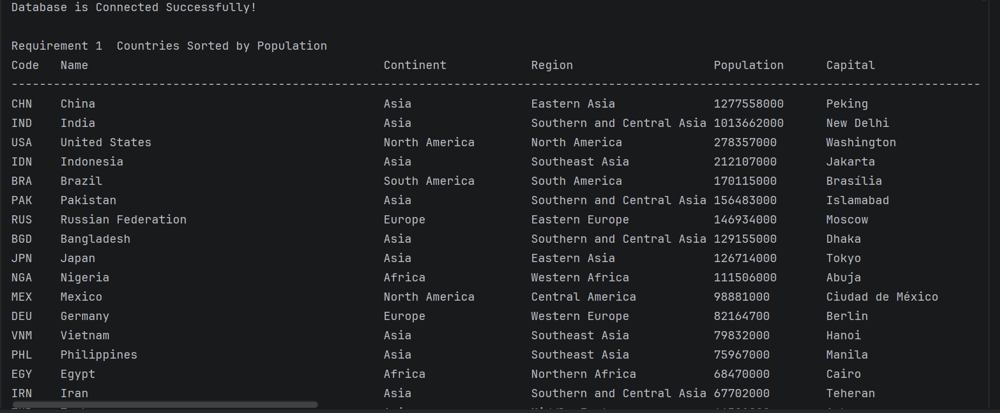
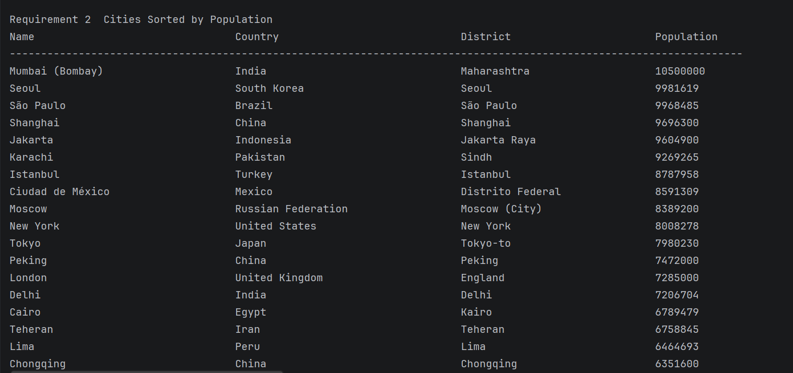
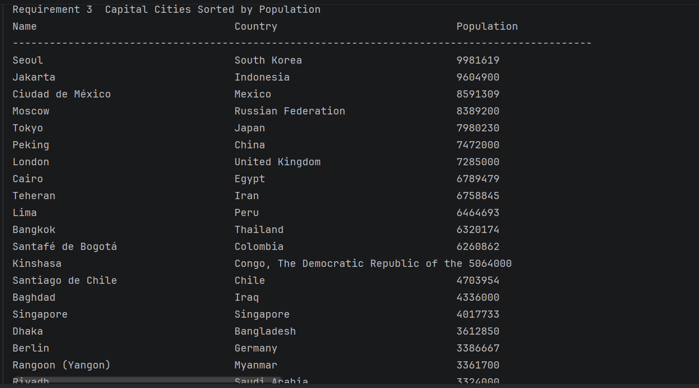
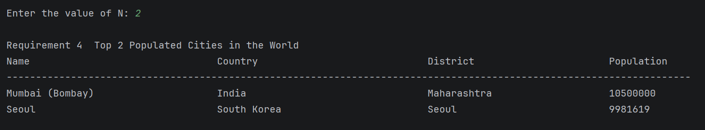
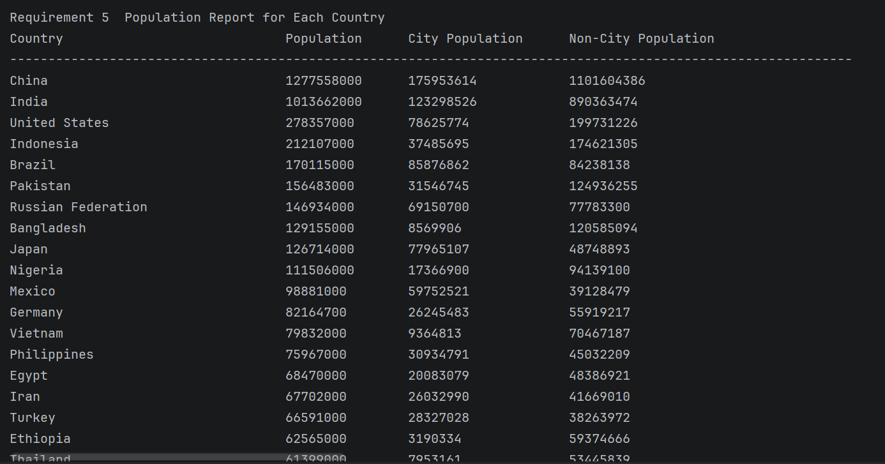
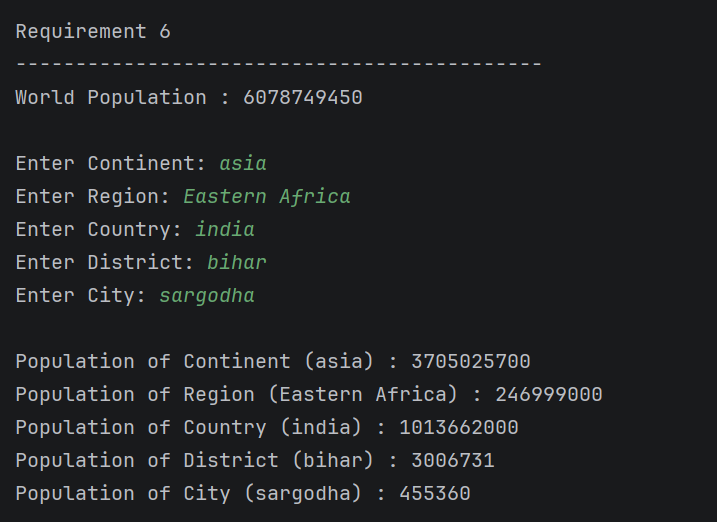
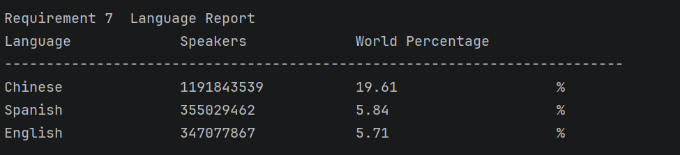
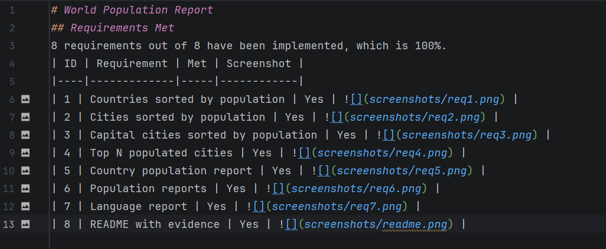
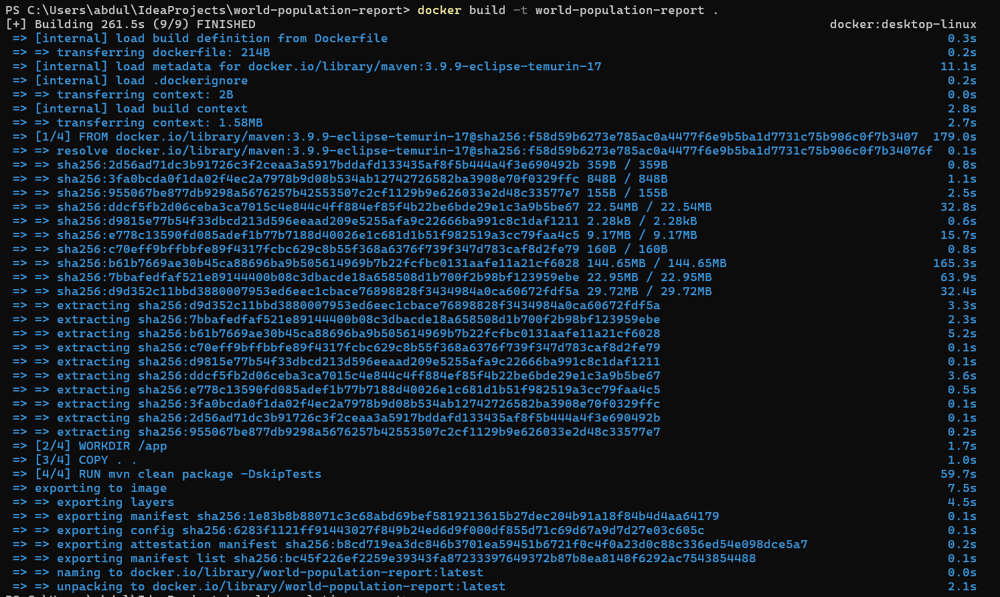
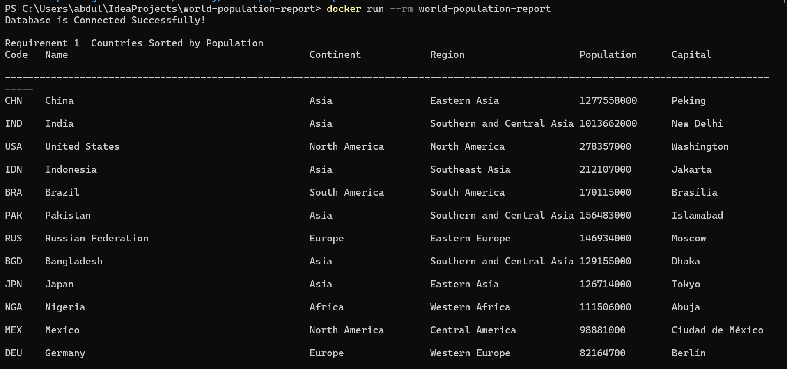

# World Population Report
The World Population Report is a Java-based application developed using Maven and MySQL. It connects to the MySQL World database and generates various population reports, including country reports, city reports, capital city reports, top populated cities, population statistics, and language reports. The project follows Software Engineering Methods practices using Git, GitHub, unit testing, and integration testing.
## Technologies Used
- Java 17
- Maven
- MySQL
- JDBC
- IntelliJ IDEA
- Git
- GitHub
- JUnit 5
## Requirements Met
8 requirements out of 8 have been implemented, which is 100%.
| ID | Requirement | Met | Screenshot |
|----|-------------|-----|------------|
| 1 | Countries sorted by population | Yes |  |
| 2 | Cities sorted by population | Yes |  |
| 3 | Capital cities sorted by population | Yes |  |
| 4 | Top N populated cities | Yes |  |
| 5 | Country population report | Yes |  |
| 6 | Population reports | Yes |  |
| 7 | Language report | Yes |  |
| 8 | README with evidence | Yes |  |

## Build Instructions
1. Firstly Clone the repository.
2. Then Open the project in IntelliJ IDEA.
3. Import the Maven project.
4. Ensure MySQL Server is running.
5. Import the world.sql database.
6. Build the project using Maven.

## Run Instructions
1. Start MySQL.
2. Verify the world database exists.
3. Configure the database credentials in DatabaseConnection.java.
4. Run Main.java.
5. Follow the console prompts to generate reports.

## Code Coverage
Unit tests have been implemented for the core model classes and application logic, including Country, City, population calculations, sorting, and Top N functionality. All implemented tests pass successfully.

# Product Backlog
| ID | Product Backlog Item | Status |
|----|----------------------|--------|
| 1 | Create Maven project |  Completed |
| 2 | Configure project structure |  Completed |
| 3 | Import World database into MySQL |  Completed |
| 4 | Create DatabaseConnection class |  Completed |
| 5 | Create Country class |  Completed |
| 6 | Create City class |  Completed |
| 7 | Create CapitalCity class |  Completed |
| 8 | Create CountryPopulationReport class |  Completed |
| 9 | Create PopulationReport class |  Completed |
| 10 | Create LanguageReport class |  Completed |
| 11 | Create CountryRepository class |  Completed |
| 12 | Create CityRepository class |  Completed |
| 13 | Create PopulationRepository class |  Completed |
| 14 | Implement Requirement 1 – Countries sorted by population |  Completed |
| 15 | Implement Requirement 2 – Cities sorted by population |  Completed |
| 16 | Implement Requirement 3 – Capital cities sorted by population |  Completed |
| 17 | Implement Requirement 4 – Top N populated cities in the world |  Completed |
| 18 | Implement Requirement 5 – Country population report |  Completed |
| 19 | Implement Requirement 6 – Population reports (World, Continent, Region, Country, District, City) | ✅ Completed |
| 20 | Implement Requirement 7 – Language report |  Completed |
| 21 | Display reports in Main.java |  Completed |
| 22 | Create unit tests for Country |  Completed |
| 23 | Create unit tests for City |  Completed |
| 24 | Create unit tests for Population calculations |  Completed |
| 25 | Create unit tests for Sorting |  Completed |
| 26 | Create unit tests for Top N |  Completed |
| 27 | Perform integration testing |  Completed |
| 28 | Configure Git repository |  Completed |
| 29 | Configure GitHub repository |  Completed |
| 30 | Use Git branches (master, develop, release) |  Completed |
| 31 | Commit project milestones |  Completed |
| 32 | Push code to GitHub |  Completed |
| 33 | Create README documentation |  Completed |
| 34 | Add screenshots to README |  Completed |
| 35 | Add build instructions |  Completed |
| 36 | Add run instructions |  Completed |
| 37 | Add project description |  Completed |
| 38 | Add requirements completed table |  Completed |
| 39 | Add badges |  Completed |
| 40 | Add license information |  Completed |
| 41 | Add release information |  Completed |
| 42 | Create user stories |  Completed |
| 43 | Create product backlog |  Completed |

### Docker Build:
The following command was used to build the Docker image:
docker build -t world-population-report .
**Result:**

### Docker Run
The following command was used to run the application inside a Docker container:
docker run --rm world-population-report
**Result:**

